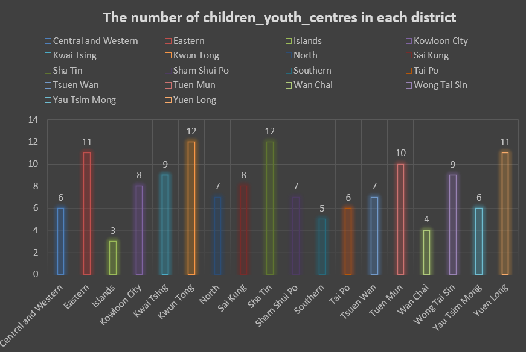
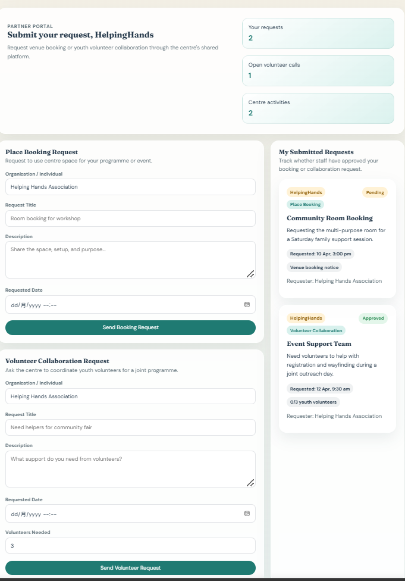
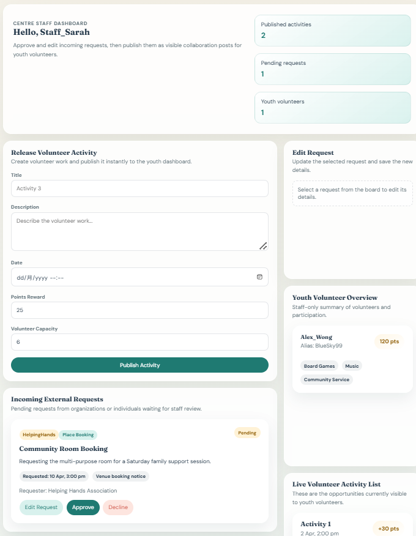
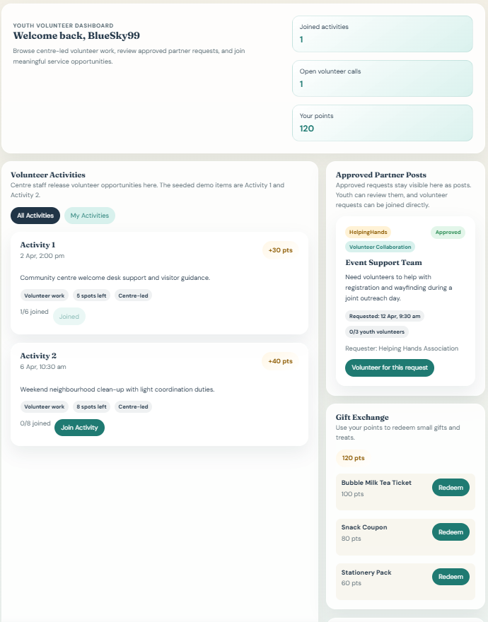

# NGO & Youth Engagement Analysis in Hong Kong

## Project Overview
This project analyzes publicly available Hong Kong district-level data to explore youth population distribution and the availability of community and youth support resources.

The goal is to identify potential gaps between youth population needs and the distribution of community facilities, and to explore how these challenges can be addressed through better coordination and engagement.

---

## Objectives
- Analyze youth population distribution across districts
- Evaluate availability of youth and community centres
- Identify potential underserved districts
- Explore how data insights can inform practical solutions

---

## Data Sources
This project uses publicly available Hong Kong data, including:
- District-level youth population statistics
- Community and youth centre data

Data was combined and structured into a single dataset for analysis.

---

## Tools Used
- Excel (data cleaning, pivot-style summary, charts)
- AI tools (data structuring and insight generation)
- GitHub (project documentation)

---

## Key Visualization

### Youth Centre Distribution by District

This visualization shows that:
- Youth centres are not evenly distributed across districts
- Some districts with high youth population do not have proportionally more centres
- Resource allocation may not fully match demand

---

## Key Insights
- Youth population distribution varies significantly across districts  
- Some districts have relatively high youth populations but fewer community resources  
- Availability of youth centres is uneven  
- Resource allocation does not always match population demand  
- Certain districts may be underserved  

---

## From Data to Problem

Beyond resource distribution, the data also implies potential inefficiencies in how existing resources are utilized and coordinated.

Even where facilities exist:
- Youth may not be fully aware of available opportunities  
- Volunteer participation may be inconsistent  
- NGOs may operate in silos with limited coordination  
- Staff may rely on manual communication processes  

This suggests that the challenge is not only about **"how many resources exist"**, but also **"how effectively they are used"**.

---

## Prototype Solution (NGO Platform Concept)

To address these challenges, I developed a simple prototype platform for NGOs and youth service centres.

---

### 🔹 Organization / Partner Portal

- Submit venue booking requests  
- Request youth volunteers for collaboration  
- Track request status (pending / approved)  
- Centralized communication with centres  

---

### 🔹 Staff Management Dashboard

- Approve and manage incoming requests  
- Create and publish volunteer activities  
- Track volunteer participation  
- Reduce manual coordination workload  

---

### 🔹 Youth Volunteer Dashboard

- Browse and join volunteer activities  
- Track participation and points  
- Redeem rewards (e.g. vouchers, gifts)  
- Discover meaningful engagement opportunities  

---

## Purpose of the Platform
The platform aims to:
- Improve visibility of volunteer opportunities  
- Increase youth participation and motivation  
- Reduce administrative workload for staff  
- Improve coordination between NGOs  
- Enhance utilization of existing community resources  

---

## Files
- `hong_kong_ngo_youth_district_analysis.csv` — dataset  
- `NGO_Analysis_Output.xlsx` — formatted data, summary, charts  
- `analysis_notes.md` — detailed analysis  
- `ngo-volunteer-platform-prototype.zip` — platform prototype  

---

## What I Learned
This project helped me understand how to:
- Combine public datasets into structured analysis  
- Identify real-world problems using data  
- Translate insights into practical solutions  
- Connect data analysis with product thinking  

---

## Project Summary
This project demonstrates a complete workflow:

**Data → Insight → Problem → Solution**

It shows how data analysis can go beyond visualization and support real-world decision-making and system design.
